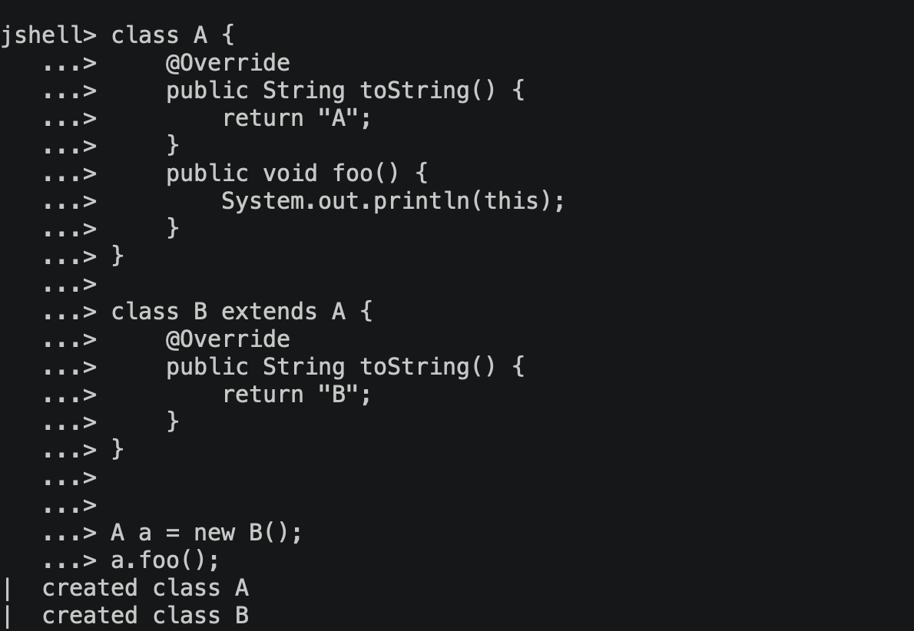

# Toolbox von Bianca Christen-Piekenbrock

Diese Toolbox ist Teil des Moduls Web Programming (EN) 22HS 5iCbb. 
Es gilt als Zusammenfassung des Modulinhaltes und soll über die Zeit ein Nachschlagewerk mit einer
Sammlung von Code snippets werden.

# MD Sprache

Bilder können so eingefügt werden:  

Links zu
webseiten: [Java Language Specification](https://docs.oracle.com/javase/specs/jls/se8/html/jls-15.html#d5e23464) 
Links zu internen files: [Notizen](woche1/Unterrichtsnotizen.md) 

## Wichtigste Code Snippets

## Unterrichtsnotizen

### Woche 1 Drehbuch, Intro, Functions

- [Präsentation](praesentationen/WebProgramming_1_Drehbuch_und_Intro.pdf)
- [Unterrichtnotizen](woche1/Unterrichtsnotizen.md)
- Mitschrieb von [functionTest.html](woche1/own/functionTest.html)
- Kopie der originalen [functionTest.html](woche1/input/functionsTest.html)
- Code snippets für das [Quiz](woche1/own/quizCode.html)

### Woche 2 Scientific foundations

### Woche 3 Algebraic Data Types, Snake

### Woche 4 Applied Science

### Woche 5 Scripting, PWA, Plotter, Excel

### Woche 6 Objects

### Woche 7 Classes

### Woche 8 Moves, User Interfaces

### Woche 9 UI Engineering

### Woche 10 Async Programming

### Woche 11 Data Flow, Excel improved

### Woche 12 Modules

### Woche 13 Transpilers, TS, PS, Elm

### Woche 14 Crazy JavaScript