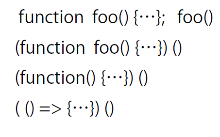

# Woche 2

## Wichtigster Input

- Begriffsdefinitionen
- Was sind Funktionen
- Man kann Funktionen in weiteren Konstanten speichern

## Schnelle Notizen

- Es gibt keinen Compiler. Deshalb erhält man keine Fehlerausgabe. Es "passiert" dann einfach nichts.
- Vergiss nicht die Returns in Funktionen. Dies führt zu Problemen.
- Vergiss nicht das Semikolon!

## "Hash"

Keys sind implizit ein String und die Werte können beliebig sein.

```javascript
const variable = {haha: "huhu", huhu: "haha"};
```

## Unterschied var und let?

## Scopes

Es gibt nur den window scope -> global

und den function scope -> function
<br> die variablen sind immer in der sie umgebenen funktion

|           |                           |                                                                                                                |
|:----------|:--------------------------|:---------------------------------------------------------------------------------------------------------------|
| x =       | globale Variable, mutable | kein guter Stil                                                                                                |
| var x =   | "hoisted" scope, mutable  | kein guter Stil<br/>egal, wo diese var angelegt wird, es wird behauptet, dass sie ganz am Anfang schon da war. |
| let x =   | local scope, mutable      | ab dort sichtbar                                                                                               |
| const x = | local scope, immutable    | ab dort sichtbar; wenn x ein array ist, kann sich die interna vom array ändern.                                |

## Code schreiben – best practice

- immer const nehmen, auch, wenn man es vielleicht später nochmal ändern will.


## Immediately invoked function expression  (IIFE)



```javascript
//direkter Aufruf von "invisible" Methoden
(() => {
    //methode
})();
```

## Lambda Calculus

