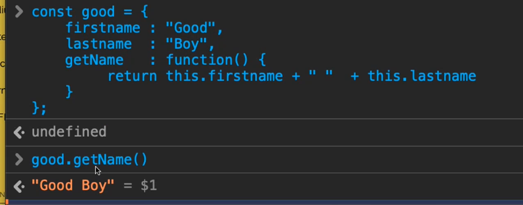
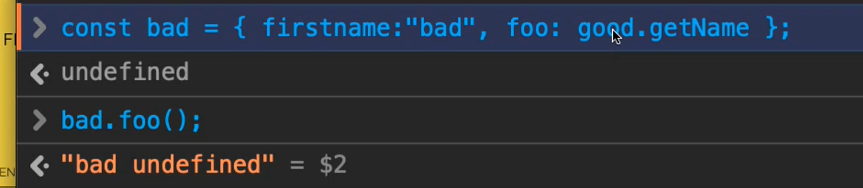

# Woche 6

## Schnelle Notizen

- java unterstützt funktionale programmierung, scripting und objektorientierung

```javascript
const foo = [1, 2, 3, 4, 5];
const [first, second] = foo;
const [first2, second2, ...rest] = foo;
// rest = [2,3,4]
const [...copy] = foo;
// copy = [1,2,3,4,5]


let x = 1;
let y = 2;
[y, x] = [x, y];
// x und y haben getauscht


const [x1, x2, x3] = [0]
// x3 ist undefined
```

- Objects sind value-pairs: x = { key: value }
    - Java-Hashmap ist nicht das Gleiche
- Das this zeigt nicht auf das object in dem wir uns befinden, sondern ist gebunden an den aufrufer (bad):
    - 
    - 

## Objekte konstruieren

### offen, dynamisch

- no safety but super dynamic 
- unobvious how to share structure 

```javascript
const good = {
    firstname: "Good",
    lastname: "Boy",
    getName: function () {
        return this.firstname + " " + this.lastname
    }
};
```

### closure scope

- hat keine vererbung
- gibt nur das raus, was man return

```javascript
function Person(first, last) {
    let firstname = first; // optional
    let lastname = last;
    return {
        getName: function () {
            return firstname + " " + lastname
        }
    }
}
```

### mixed, classified

- muss immer mit new aufgerufen werden
- Person ist sichtbar, alles darin ist unsichtbar
- durch diese Methode kann man instancof machen

```javascript
const Person = (() => { // lexical scope
    function Person(first, last) { // ctor, binding
        this.firstname = first;
        this.lastname = last;
    }

    Person.prototype.getName = function () {
        return this.firstname + " " + this.lastname;
    };
    //Das ist die Person vom lokalen Scope
    return Person;
})(); // IIFE

new Person("Good", "Boy") instanceof Person

```
