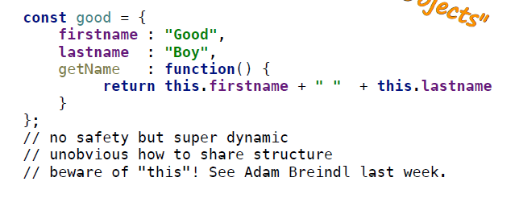
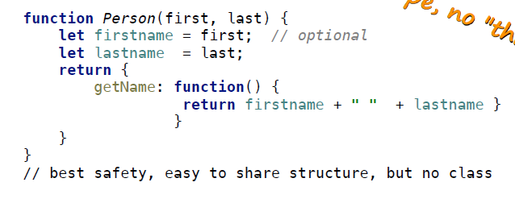
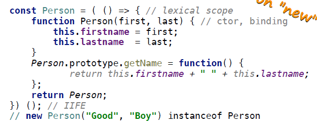
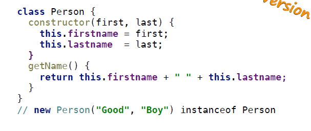

# Woche 7

## Schnelle Notizen
- wenn man super() vergisst oder an der falschen Stelle macht, wird das nicht automatisch gemacht!
- funktionen sind Objekte

## Objekte Programmierung

- Es gibt 3 Möglichkeiten Objekte zu erstellen:
    - open, dynamic
      
    - closed, explicit
      
    - mixed, classified
      
    - variante von mixed, classified
      Es wurde in javascript das keyword ```class``` hinzugefügt
      


## Prototype chain
