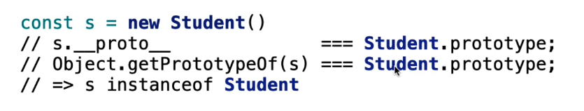
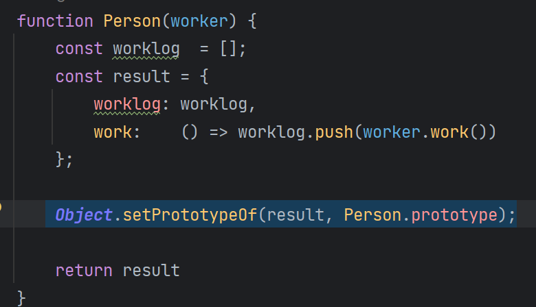
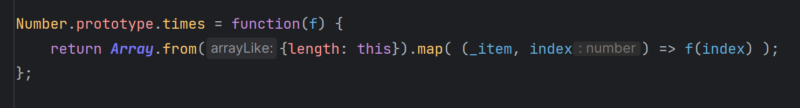

# Woche 7

## Schnelle Notizen
- wenn man super() vergisst oder an der falschen Stelle macht, wird das nicht automatisch gemacht!
- funktionen sind Objekte

## Objekte Programmierung

- Es gibt 3 Möglichkeiten Objekte zu erstellen:
    - open, dynamic
      
    - closed, explicit
      
    - mixed, classified
      
    - variante von mixed, classified
      Es wurde in javascript das keyword ```class``` hinzugefügt
      


## Prototype chain

- Prototyp von einem Objekt herausfinden
  
- Prototypen sind Objekte, also können sie auch modifiziert und erweitert werden.
- So setzt man den Prototypen
  
- Prototypen kann man während der Runtime ändern
- Um z.B. diese times Function aufzurufen, muss man sagen, auf welchen Prototypen das aufgerufen wird
  