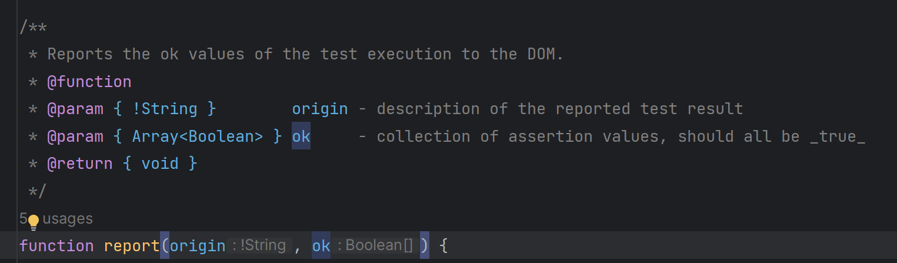

# Woche 7

## Schnelle Notizen
 - in ``` let obj = { x: x, y: y} ``` ist das erste x und das y automatisch in "", weil es der Key ist
- ```console.log({x,y})``` ruft die toString methode auf, weil {} es zu einem Objekt macht
- In die JsDoc kann man infos reinschreiben, die die IDE unterstützen / Auswirkungen auf die IDE haben
- Die JS_TypeSystems.xml ist eine aktuelle "verbesserte" Ansicht
  

## Types in JS
- built-in types:
  - boolean
  - number
  - string
  - object
  - BigInt
  - Symbol
  - Function
  - null / undefined
- built-in types unterscheiden sich, in dem die Methode ```typeof``` nur diese zurückgeben kann

